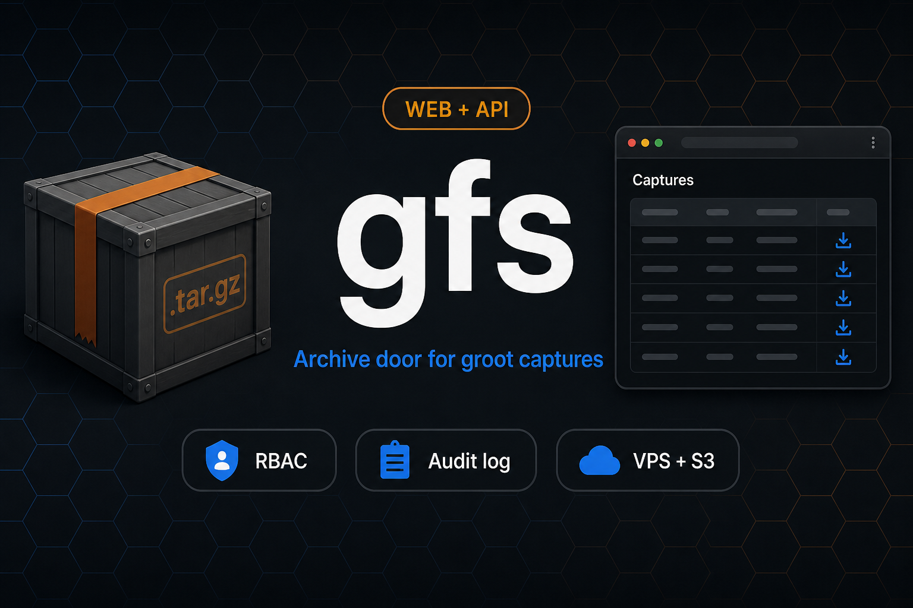

# gfs — groot files share

<a id="readme-top"></a>

**📦** _Web and API door for groot `.tar.gz` archives when a VPS exists_

[](https://github.com/hrodrig/groot-share/releases)
[](https://github.com/hrodrig/groot-share/releases)
[](https://go.dev/)
[](./LICENSE)
[](https://github.com/hrodrig/groot-share/actions/workflows/ci.yml)
[](https://gghstats.hermesrodriguez.com/hrodrig/groot-share)

**Repo:** [github.com/hrodrig/groot-share](https://github.com/hrodrig/groot-share) · **Releases:** [GitHub Releases](https://github.com/hrodrig/groot-share/releases) · **Spec:** [docs/SPECIFICATIONS.md](docs/SPECIFICATIONS.md) · **Alternatives:** [docs/ALTERNATIVES.md](docs/ALTERNATIVES.md) · **Operator:** [groot-selfhosted](https://github.com/hrodrig/groot-selfhosted) · **Changelog:** [CHANGELOG.md](CHANGELOG.md) · **Roadmap:** [.planning/ROADMAP.md](.planning/ROADMAP.md) · **Consensus:** [docs/GFS-CONSENSUS.md](docs/GFS-CONSENSUS.md)

<p align="center">
  
</p>

## The problem

Teams on a **shared Kubernetes cluster** need **one catalog** of [groot](https://github.com/hrodrig/groot) diagnostic `.tar.gz` files — for incidents, RCA, and handoffs. Archives are often **several GB**. Producers include **laptops** (adhoc collect), **bastion hosts** (Docker / cron / systemd via [groot-selfhosted](https://github.com/hrodrig/groot-selfhosted)), and **in-cluster** jobs ([groot-trigger](https://github.com/hrodrig/groot-trigger), CronJob).

The usual shortcuts fail:

- **Put the same S3-compatible bucket key on every laptop** — revoke or leak hits the **whole** bucket; many providers (Contabo, Hetzner, Wasabi, MinIO, …) do not give you per-engineer IAM for free.
- **“Just use Cyberduck”** — no per-user audit, retention, or upload API keyed to usernames; bastion, laptop, and cluster uploads stay disconnected unless you glue them.
- **“Run only groot-trigger”** — great for **starting** a collect; it does **not** list, download, or retain archives ([trigger SPEC](https://github.com/hrodrig/groot-trigger/blob/main/docs/SPECIFICATIONS.md)).

## How gfs solves it

**gfs** is a small **VPS service**: login + scoped API keys, HTTP ingest, Captures UI, audit log, and retention — in front of groot archives. **Laptops and bastion hosts** never need long-lived `AWS_*` on every operator machine. On **vps-s3**, the cluster still prefers **`groot upload.s3` straight to the bucket** (multi-GB skips the VPS); bastions may HTTP POST to gfs or use `upload.s3` / `upload.sftp` per [groot-selfhosted](https://github.com/hrodrig/groot-selfhosted) playbook. gfs **lists the same prefix** so HTTP, S3, and (future) SFTP ingest appear in one place.

**gfs is not universal.** If you have **only** a bucket and no VPS, the better path is **S3 only** (groot `upload.s3` + S3 client) — **do not deploy gfs**. Full decision matrix with trade-offs: **[docs/ALTERNATIVES.md](docs/ALTERNATIVES.md)**.

### Choosing an approach (at a glance)

| Situation | Best choice |
|-----------|-------------|
| Bucket only, no VPS, operators use S3 tools | **S3 only** — [groot-selfhosted s3-contabo example](https://github.com/hrodrig/groot-selfhosted/tree/main/run/examples/s3-contabo) |
| VPS, archives on disk, small team | **gfs `vps`** |
| Bucket + laptops/bastions without `AWS_*` + cluster multi-GB | **gfs `vps-s3`** + cluster `upload.s3` |
| Scheduled or bastion collect (jump host) | **groot-selfhosted** standalone / Docker → gfs HTTP or `upload.s3` |
| “Generate capture” button in cluster | **groot-trigger** + one of the storage rows above |
| SFTP drop box today | **groot `upload.sftp`** playbook; gfs watcher [planned](.planning/ROADMAP.md) |

→ **[Full comparison, pros/cons, and transparency about gfs limits](docs/ALTERNATIVES.md)**

> **Not a replacement for groot.** Collect, validate, and analyze stay in the **groot** CLI. **groot-trigger** starts on-demand collects in-cluster. **groot-selfhosted** ships CronJob / bastion playbooks. **gfs** appears only in topologies where a VPS is the operator-chosen door.

**Related tools (same maintainer):**
- **[pgwd](https://github.com/hrodrig/pgwd)** — PostgreSQL connection watchdog ([live traffic](https://gghstats.hermesrodriguez.com/hrodrig/pgwd); deploy: [pgwd-selfhosted](https://github.com/hrodrig/pgwd-selfhosted))
- **[gghstats](https://github.com/hrodrig/gghstats)** — GitHub repo traffic beyond 14 days ([live demo](https://gghstats.hermesrodriguez.com); deploy: [gghstats-selfhosted](https://github.com/hrodrig/gghstats-selfhosted))
- **[kzero](https://github.com/hrodrig/kzero)** — bastion-first declarative workload reset ([live traffic](https://gghstats.hermesrodriguez.com/hrodrig/kzero); deploy: [kzero-selfhosted](https://github.com/hrodrig/kzero-selfhosted))
- **[groot](https://github.com/hrodrig/groot)** — Kubernetes diagnostics archive ([live traffic](https://gghstats.hermesrodriguez.com/hrodrig/groot); deploy: [groot-selfhosted](https://github.com/hrodrig/groot-selfhosted))

## Table of contents

- [The problem](#the-problem)
- [How gfs solves it](#how-gfs-solves-it)
- [Choosing an approach (at a glance)](#choosing-an-approach-at-a-glance)
- [Groot family roles](#groot-family-roles)
- [Operator topologies](#operator-topologies)
- [Features](#features)
- [Quick start (local)](#quick-start-local)
- [Configuration](#configuration)
- [HTTP API (summary)](#http-api-summary)
- [Build and test](#build-and-test)
- [Documentation](#documentation)
- [License](#license)

[↑ Back to top](#readme-top)

## Groot family roles

| Repo | Role |
|------|------|
| **[groot](https://github.com/hrodrig/groot)** | CLI: `collect` / validate / inspect / analyze → `.tar.gz`; optional `upload.s3` / `upload.gcs` / `upload.sftp` |
| **[groot-trigger](https://github.com/hrodrig/groot-trigger)** | In-cluster HTTP → Job `groot collect`; fire-and-forget; optional post-collect upload |
| **gfs** (this repo) | VPS web + API: auth, HTTP ingest, list, download, audit, retention (`vps` and `vps-s3` topologies) |
| **[groot-selfhosted](https://github.com/hrodrig/groot-selfhosted)** | Operator deploy: CronJob, bastion, Helm; S3-only and SFTP-VPS playbooks |

## Operator topologies

Deploy-time choice. **No per-upload “also S3” flag.**

| Topology | gfs process? | Where archives live | Who lists |
|----------|--------------|---------------------|-----------|
| **VPS only** | yes | VPS disk (home) | gfs |
| **S3 only** | **no** | Bucket via groot `upload.s3` | S3 client (Cyberduck, `aws`, rclone, …) |
| **VPS + S3** | yes | Staging on VPS → **bucket is home** | gfs (from bucket + HTTP/S3 ingest keys) |

Details and open questions: [docs/GFS-CONSENSUS.md](docs/GFS-CONSENSUS.md). **When not to use gfs:** [docs/ALTERNATIVES.md](docs/ALTERNATIVES.md).

## Features

- Session login + scoped API keys (`upload` | `read`)
- Roles: `viewer`, `uploader`, `admin` (RBAC on every route)
- Server-rendered HTML: Captures, Upload, Activity, Settings, admin Users
- HTTP ingest of groot `.tar.gz` (browser or `POST /v1/archives`)
- Cluster archives via shared S3 prefix (`source=s3`) on **vps-s3**
- Audit log (upload / download / delete / user actions; no secrets in rows)
- Retention: `keep_last` **or** `max_age_days` (defaults 20 / 90)
- Fail-closed config (`GFS_TOPOLOGY`, bootstrap admin, bucket creds)
- Supply chain aligned with **groot-trigger** (GNU Make, GoReleaser, distroless, CI)

**Planned:** SFTP inbox watcher (groot `upload.sftp` drop dir) — [Phase 8](.planning/ROADMAP.md).

## Quick start (local)

**Requirements:** Go 1.26+ (see [`go.mod`](go.mod)).

```bash
git clone https://github.com/hrodrig/groot-share.git
cd groot-share
cp .env.example .env    # edit GFS_BOOTSTRAP_* (min 8 chars)
make serve              # builds bin/gfs, loads .env, listens on :8080
```

Open [http://127.0.0.1:8080/login](http://127.0.0.1:8080/login) with the bootstrap credentials from `.env`. Data and SQLite live under `GFS_DATA_DIR` (default `./var/lib/gfs`).

Probes: `GET /healthz`, `GET /readyz`.

[↑ Back to top](#readme-top)

## Configuration

Environment-only (`GFS_*`). See [docs/SPECIFICATIONS.md §5](docs/SPECIFICATIONS.md) for the full contract.

| Variable | Purpose |
|----------|---------|
| `GFS_TOPOLOGY` | **Required.** `vps` or `vps-s3` |
| `GFS_DATA_DIR` | **Required.** SQLite + home/staging root |
| `GFS_LISTEN` | Bind address (default `:8080`) |
| `GFS_BOOTSTRAP_ADMIN` / `GFS_BOOTSTRAP_PASSWORD` | First admin when user table is empty; ignored once users exist |
| `GFS_S3_*` + `AWS_*` | Required for `vps-s3` (bucket, endpoint, prefix, path-style) |
| `GFS_KEEP_LAST` / `GFS_MAX_AGE_DAYS` | Retention (defaults 20 / 90) |
| `GFS_MAX_UPLOAD_BYTES` | Upload cap (default 32 GiB) |

Copy [.env.example](.env.example) for local dev; **never commit** `.env`.

[↑ Back to top](#readme-top)

## HTTP API (summary)

| Endpoint | Auth | Notes |
|----------|------|-------|
| `GET /healthz` | none | Liveness |
| `GET /readyz` | none | SQLite (+ bucket on vps-s3) |
| `POST /login` | none | Session cookie |
| `GET /` | session | Captures HTML |
| `POST /v1/archives` | session or api_key (`upload`) | Ingest `.tar.gz` |
| `GET /v1/archives` | session or api_key (`read`) | JSON list |
| `GET /v1/archives/{id}/file` | session or api_key (`read`) | Download |
| `DELETE /v1/archives/{id}` | admin session | Delete |
| `GET /v1/audit` | session or api_key (`read`) | Audit JSON |
| `GET/POST /v1/users`, `PATCH /v1/me`, … | admin / session | User and key management |

Behavior contract: [docs/SPECIFICATIONS.md](docs/SPECIFICATIONS.md).

[↑ Back to top](#readme-top)

## Build and test

```bash
make build          # bin/gfs
make test           # race detector
make cover          # COVER_MIN=70
make ci             # fmt-check + lint + gocyclo + test
make release-check  # release gate (maintainers)
```

Install to `$GOPATH/bin`: `make install`.

[↑ Back to top](#readme-top)

## Documentation

| Doc | Contents |
|-----|----------|
| [docs/ALTERNATIVES.md](docs/ALTERNATIVES.md) | Problem narrative, comparisons, **best choice per situation**, gfs limits |
| [docs/SPECIFICATIONS.md](docs/SPECIFICATIONS.md) | Approved behavior contract |
| [docs/GFS-CONSENSUS.md](docs/GFS-CONSENSUS.md) | Product freeze and topology decisions |
| [CHANGELOG.md](CHANGELOG.md) | Release notes |
| [.planning/ROADMAP.md](.planning/ROADMAP.md) | Phases and progress |
| [AGENTS.md](AGENTS.md) | Contributor / agent constraints |
| [SECURITY.md](SECURITY.md) | Vulnerability reporting |

English for all repo artifacts.

[↑ Back to top](#readme-top)

## License

MIT — see [LICENSE](./LICENSE).
